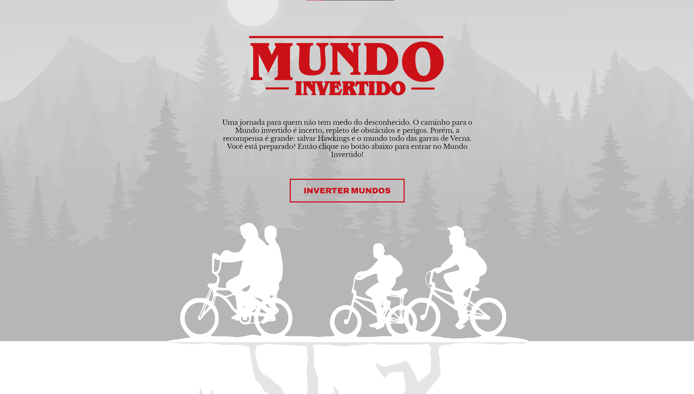

# Mundo Invertido Stranger Things

Este site interativo foi inspirado na icônica série "Stranger Things". Desenvolvido com HTML, CSS e JavaScript, esta landing page única oferece uma experiência imersiva e envolvente. Ao entrar, você será recebido com uma trilha sonora arrepiante que transporta você diretamente para os mistérios de Hawkins. Com funcionalidades interativas, você pode alternar entre os mundos normal e invertido, desvendando os enigmas e segredos ocultos. Cada tema de página reflete a temática da série, com visuais cativantes e efeitos sonoros que o mergulham na atmosfera intrigante e sobrenatural de Stranger Things.

## 🚀 Demonstração

[Clique aqui](https://flaviomattosdev.github.io/Mundo-Invertido-Stranger-Things/) para acessar o resultado final do projeto.

## 🛠️ Tecnologias Utilizadas

* [HTML](https://developer.mozilla.org/pt-BR/docs/Web/HTML) - Linguagem de Marcação
* [CSS](https://developer.mozilla.org/pt-BR/docs/Web/CSS) - Linguagem de Estilização
* [Javascript](https://developer.mozilla.org/pt-BR/docs/Web/JavaScript) - Linguagem de Programação

## 👨‍💻 Desenvolvedor

    
    
&nbsp&nbsp&nbspFlávio Mattos 
    &nbsp&nbsp&nbsp<a href="https://www.instagram.com/fflaviomattos/">Instagram</a>&nbsp;|&nbsp;<a href="https://github.com/FlavioMattosDev">GitHub</a>&nbsp;|&nbsp;<a href="https://www.linkedin.com/in/flavio-mattos/">LinkedIn</a>&nbsp;

  

---
